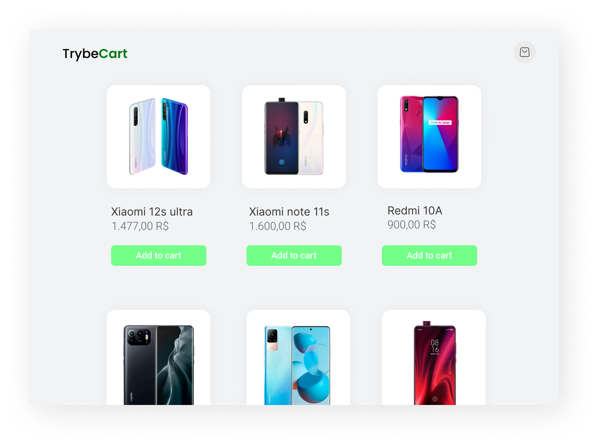

  

# Sobre o projeto
Adicione produtos vindo de uma API, ao seu carrinho, que lhe mostra o valor total da compra

# Tecnologias utilizadas
- HTML
- CSS
- Javascript

O projeto tem o objetivo de por em prática os conceitos de **fetch e localStorage**
